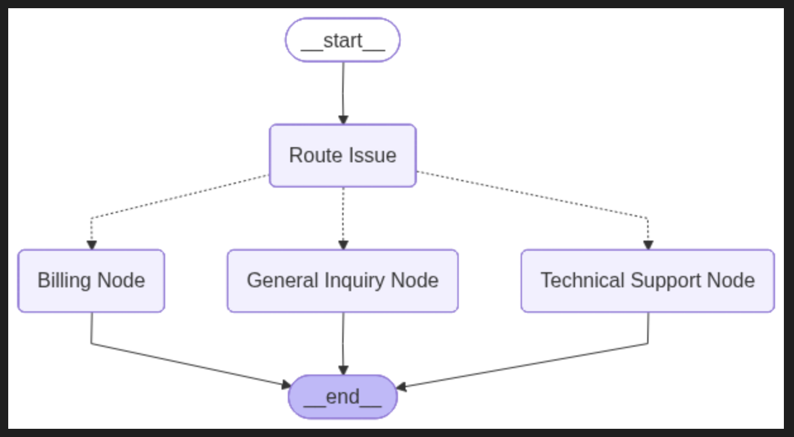

# Smart Support Router

**Overview**

This folder contains a conditional routing example built with LangGraph. The graph inspects a user's support message, determines the appropriate support department (Technical Support, Billing, or General Inquiry), and routes the request to the correct handler node which produces a detailed response.

## Architecture (ASCII)

```
								 START
									 |
						 +-----+------+
						 | Route Issue|
						 +-----+------+
									 |
			+------------+------------+
			|            |            |
			v            v            v
	Billing     Technical Support  General
	 Node            Node         Inquiry
		|                |             |
		+-------+--------+-------------+
						|
						v
					 END
```

## Files

- `graph.py` — constructs the `StateGraph`, defines the `check_route` function used for conditional branching, and compiles the graph to `app`.
- `nodes.py` — node implementations:
	- `route_issue` — uses a structured LLM call to extract `user_issue` and `route_to`.
	- `technical_support_node`, `billing_node`, `general_inquiry_node` — generate department-specific responses saved into `state['support_response']`.
- `main.py` — small `FastAPI` app exposing `POST /healthy` and `POST /supportRequest` endpoints and invoking the graph.
- `state.py` — `TypedDict` describing the `State` schema shared across nodes.

## Flow
1. Client sends `user_prompt` to `POST /supportRequest`.
2. `route_issue` extracts `user_issue` and `route_to` (one of `Technical Support`, `Billing`, `General Inquiry`).
3. Graph conditionally routes to the matching node using `graph.add_conditional_edges(...)` and the `check_route` function.
4. Selected node runs, produces `support_response` and the graph ends.

## API Endpoints

- `POST /healthy` — returns `{"status": "healthy_conditional_graphs"}`.
- `POST /supportRequest` — accepts `user_prompt` as a query parameter and returns the final `State` including `support_response`.

Example curl:

```bash
curl -X POST "http://127.0.0.1:8000/supportRequest?user_prompt=My%20router%20is%20overheating%20and%20keeps%20disconnecting"
```

## State shape

- `user_prompt`: str (input)
- `user_issue`: str (normalized issue description)
- `route_to`: str ("Technical Support" | "Billing" | "General Inquiry")
- `support_response`: str (final reply)

## Implementation notes

- `route_issue` uses `pydantic` + `.with_structured_output()` to enforce a stable routing result and avoid JSON parsing errors.
- Conditional routing uses the `check_route` helper which reads `state['route_to']` and returns the node name to run next.
- Replace `image.png` (if present) with a diagram you prefer — README originally referenced an image placeholder.

## Requirements and setup

- Python 3.9+
- Install dependencies (PowerShell):

```powershell
pip install fastapi uvicorn python-dotenv pydantic langchain-openai langgraph
```

Set up credentials in a `.env` file:

```
OPENAI_API_KEY=your_key_here
```

## Running locally

```powershell
cd conditional_graphs
uvicorn main:app --reload
```

## Programmatic usage

```python
from graph import app as graph_app

initial_state = {"user_prompt": "I was billed twice for this month's invoice"}
result = graph_app.invoke(initial_state)
print(result['route_to'])
print(result['support_response'])
```

## Next steps / suggestions

- Use a Pydantic request model for FastAPI instead of query params for production.
- Add robust error handling and retries around LLM calls.
- Add unit tests verifying routing decisions for representative inputs.
- Add logging/tracing to observe routing decisions in production.

---